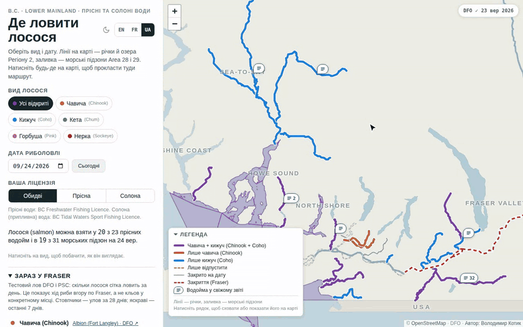
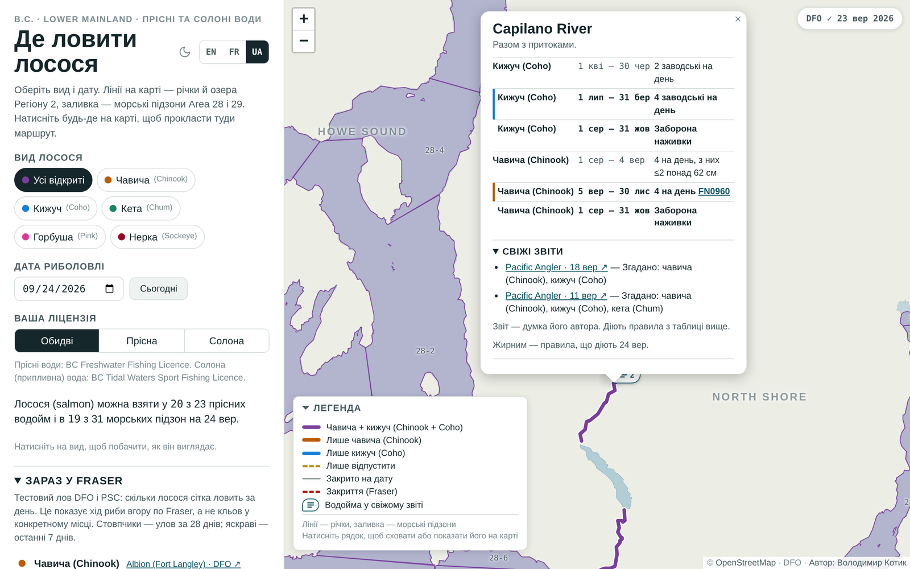
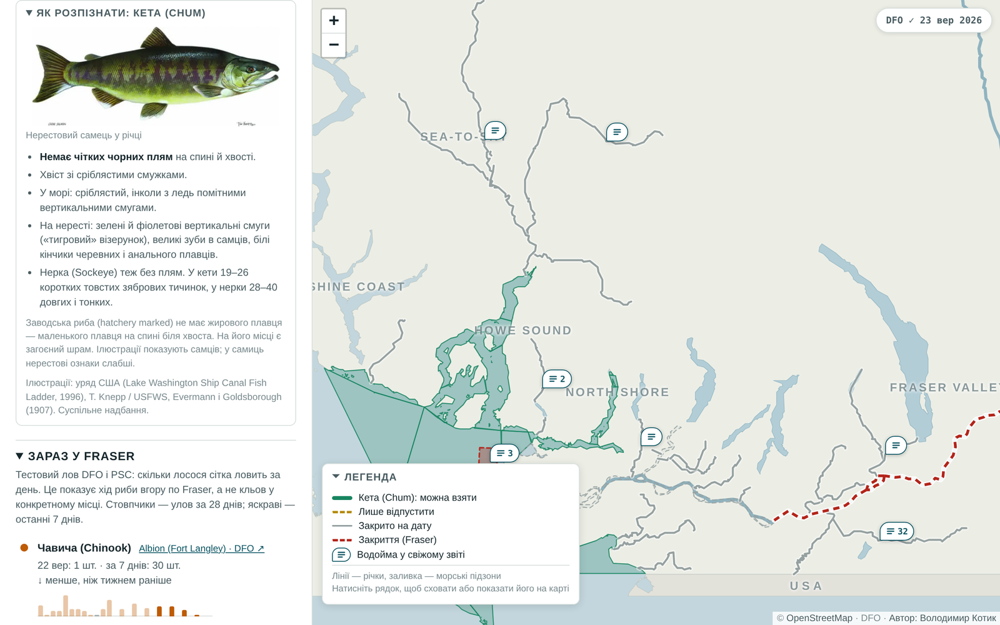
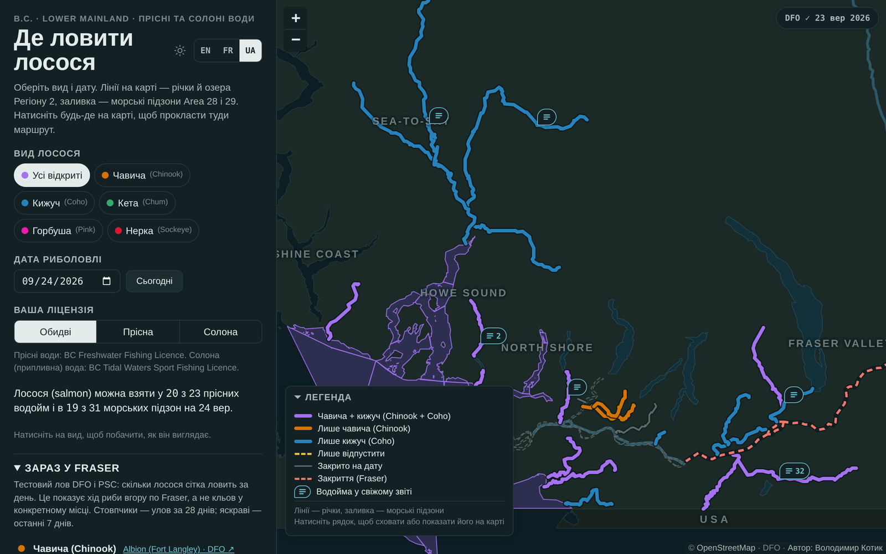
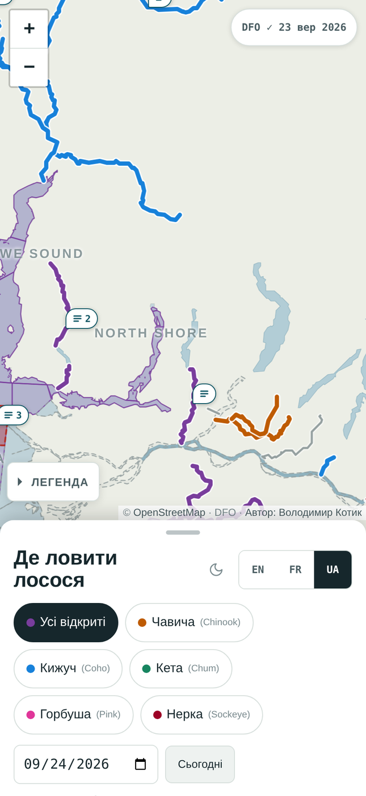
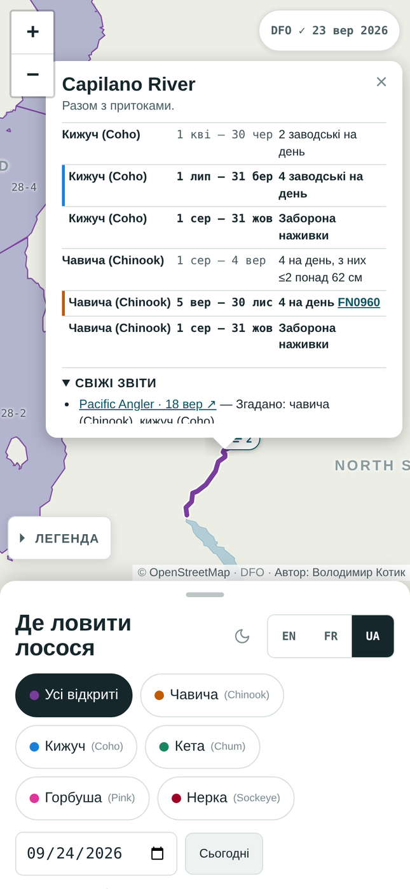

# Лосось Metro Vancouver

[English](README.md) · **Українська**

Інтерактивна карта: де і коли можна ловити тихоокеанського лосося в Lower Mainland (B.C.), за видом і датою.
Сторінка доступна англійською, французькою та українською.

**Карта:** https://volkotyk.github.io/bc-salmon-map/ · Українська [`#uk`](https://volkotyk.github.io/bc-salmon-map/#uk) · English [`#en`](https://volkotyk.github.io/bc-salmon-map/#en) · Français [`#fr`](https://volkotyk.github.io/bc-salmon-map/#fr)



> **Це не офіційне джерело.** Правила змінюються через fishery notices DFO. Перед риболовлею завжди перевіряйте
> [сторінки DFO](#джерела-даних). Межі ділянок річок на карті приблизні.

## Як користуватися

1. **Оберіть вид** (або *Усі відкриті*). Карта фарбує кожну водойму за тим, що там можна залишити цього дня; картка нижче показує, як виглядає риба.
2. **Оберіть дату.** Карта і список показують правила на цей день. *Сьогодні* повертає до поточної дати.
3. **Оберіть ліцензію:** *Прісна*, *Солона* або *Обидві*. Водойми для іншої ліцензії стають блідими.
4. **Натисніть на річку, озеро чи морську підзону** (на карті або в списку): відкриється таблиця правил, fishery notices і свіжі звіти.
5. **Натисніть будь-де на карті**: з'являться координати й маршрут туди в Google Maps.
6. **Змініть тему й мову** кнопкою з місяцем / сонцем і перемикачем **EN · FR · UA** угорі панелі.

| Вікно водойми | Картка виду |
|---|---|
|  |  |

| Темна тема | Телефон | Вікно водойми на телефоні |
|---|---|---|
|  |  |  |

На скріншотах — вбудована контурна карта; на сайті ті самі шари лежать поверх карти OpenStreetMap.

## Що показує карта

| Шар | Вміст | Джерело |
|---|---|---|
| Річки й озера (лінії) | 23 водойми DFO **Region 2 – Lower Mainland**: відкриття на лосося, ліміти, правила щодо снастей, ділянки | Таблиця DFO для прісних вод |
| Морські підзони (заливка) | Усі 31 підзона DFO **Area 28 і 29**: Howe Sound, Burrard Inlet, Strait of Georgia, припливна частина Fraser | Сторінки DFO для солоних вод + межі підзон DFO PFMA |
| Сезонне закриття | Закриття гирла Fraser для лосося (1 серпня – 30 вересня), намальоване за координатами DFO | Сторінка DFO Area 29 |
| Зараз у Fraser (панель) | Денний улов тестових сіток на Fraser: Albion для чавичі (Chinook), кети (Chum) і кижуча (Coho), Whonnock і Qualark для нерки (Sockeye) (і для горбуші (Pink) у роки горбуші). У кожному рядку: остання проба, сума за 7 днів, тренд, стовпчики за 28 днів. Найновіші звіти рибальських магазинів з видами й водоймами, які вони згадують; кнопка водойми переносить карту до неї | [DFO Albion test fishery](https://www.pac.dfo-mpo.gc.ca/fm-gp/fraser/albion-eng.html), [PSC test fishing results](https://www.psc.org/publications/fraser-panel-in-season-information/test-fishing-results/) (таблиці PDF), [Pacific Angler Friday Fishing Report](https://www.pacificangler.ca/blogs/learn), Reddit [r/fishingBC](https://www.reddit.com/r/fishingBC/) і [r/chilliwack](https://www.reddit.com/r/chilliwack/) (публічні стрічки) |
| Основа карти | Справжні тайли OpenStreetMap, коли хостинг їх дозволяє; інакше вбудована контурна карта (узбережжя, озера, річки) | OpenStreetMap |

Можливості:

- Фільтр за видом: чавича (Chinook), кижуч (Coho), кета (Chum), горбуша (Pink), нерка (Sockeye). Поруч з українською назвою завжди є англійська назва DFO.
- Картка розпізнавання: оберіть вид, і з'являться малюнки морської й нерестової форми та головні ознаки (ясна, плями на хвості, кольори).
- Вибір дати: карта і список показують правила на цей день, зокрема періоди, що переходять через Новий рік.
- Перемикач ліцензії: *Обидві*, *Прісна* (BC Freshwater Fishing Licence) або *Солона* (BC Tidal Waters Sport Fishing Licence). З однією ліцензією список і підсумок показують лише водойми, які вона покриває; інші водойми лишаються на карті блідими контурами, а їхнє вікно називає потрібну ліцензію. Вибір запам'ятовується.
- Кольори: чавича + кижуч, лише чавича, лише кижуч, лише відпустити, закрито, закриття. Клік на рядок легенди ховає або показує цей шар на карті.
- Клік на водойму відкриває повну таблицю правил, примітки й посилання на fishery notices.
- Клік будь-де на карті показує координати й посилання на **маршрут у Google Maps** / OpenStreetMap.
- **Оновлюється сама:** щодня GitHub Actions читає три сторінки DFO і перевидає карту з новими правилами. Сторінка показує, коли DFO перевіряли востаннє і коли правила востаннє змінилися.
- Панель «Зараз у Fraser» оновлюється щодня: який лосось потрапляє в тестові сітки DFO і PSC на Fraser, і посилання на свіжі звіти рибальських магазинів. Значок-бульбашка позначає кожну водойму, яку згадує звіт за останні 21 день (число — кількість звітів); вікно водойми показує ці звіти під правилами. Сторінка зберігає лише заголовки, дати, посилання й теги видів, а не текст звіту. Вид у звіті не означає, що його можна залишити. Reddit читається з публічних стрічок r/fishingBC і r/chilliwack (без API-ключа): допис рахується, лише коли він згадує водойму з карти, лосося і слово про улов, а заголовок не є питанням. Instagram, Facebook і TikTok не мають публічного API пошуку для такого використання; їхні дописи додавайте вручну.
- Перемикач EN / FR / UA (також `#en` / `#fr` / `#uk` в адресі; вибір запам'ятовується). За замовчуванням — англійська. Світла й темна теми: сторінка стежить за темою системи; кнопка з сонцем / місяцем поруч із перемикачем мови змінює її, і сторінка пам'ятає вибір, доки він не збігається з темою системи.
- Блоки, що згортаються: клік на заголовок згортає «Зараз у Fraser», його список звітів, кожну групу районів і список звітів у вікні водойми. Сторінка пам'ятає згорнуті блоки.
- Спершу телефон: на телефоні карта займає весь екран, а панель виїжджає знизу. Потягніть панель або торкніться її ручки: низьке положення показує вид і дату, середнє додає список, високе показує все. Від 768 px завширшки панель стоїть збоку.

## Структура репозиторію

```
.github/workflows/pages.yml   щодня + при push: оновити правила з DFO, закомітити зміни, отримати дані «Зараз у Fraser», зібрати index.html, опублікувати на Pages
.github/workflows/pr-preview.yml   pull requests: отримати дані «Зараз у Fraser» (strict), зібрати index.html, додати як артефакт site-preview; без публікації
README.uk.md          цей файл українською (README.md — англійською)
docs/screenshots/      скріншоти й демо-GIF для README (англійською та українською)
dfo/
  update.py             читає сторінки DFO, розбирає таблиці, перевіряє, пише build/rules.json + build/status.json
  catalog.py            знання, що ведуться вручну: назви DFO -> лінії на карті, назви груп, українські й французькі тексти
  htmltable.py          маленький читач HTML-таблиць (rowspan/colspan)
  snapshots/            текст лососевої частини кожної сторінки DFO (історія git показує, що змінив DFO)
build/
  template.html         код сторінки: розмітка, CSS, JS, тексти інтерфейсу EN/FR/UA
  rules.json            правила риболовлі з DFO (генерується; зручні диффи в git)
  status.json           остання зміна правил і "pending", коли оновлення заблоковано
  leaflet.css           CSS Leaflet 1.9.4 (вбудовується під час збирання; JS Leaflet вантажиться з cdnjs)
  geo.json              геометрія карти: суша, річки, озера, морські підзони
  sub.geojson           підзони DFO PFMA для Area 28–29 (сирі дані)
  species/*.webp        малюнки видів (суспільне надбання), вбудовуються в сторінку; їх завантажує fetch_species.py
  fetch_reports.py      тестовий лов DFO/PSC + стрічки звітів магазинів -> reports.json (джерело, що не відповіло, зберігає попередні дані)
  reports.json          дані «Зараз у Fraser» (генерується; комітиться, коли дані змінилися, тож історія git — щоденний знімок)
  manual/reports.csv    звіти, додані вручну (див. «Додати дані вручну»)
  manual/testfish.csv   рядки тестового лову чи підрахунків, додані вручну
  *.py                  завантаження геометрії + скрипти збирання, assemble.py
```

## Додати дані вручну

Для звіту чи таблиці, яких не покриває жодне автоматичне джерело: допис на форумі, повідомлення від рибалки,
таблиця підрахунків з іншого сайту. Правила для колонок описані в коментарях на початку кожного файлу.

1. Додайте рядок у `build/manual/reports.csv` (звіт) або `build/manual/testfish.csv` (денні підрахунки):
   ```
   2026-09-21,FishingWithRod,Coho on the lower Vedder,https://www.fishingwithrod.com/...,coho,Vedder
   ```
   Вид можна писати англійською чи українською (`coho` або `кижуч`); водойму — назвою (`Vedder`, `Capilano River`),
   id з `build/rules.json` або морською підзоною (`28-8`). Кілька значень розділяйте `;`.
2. Перевірте локально: `cd build && python fetch_reports.py --strict && python run_all.py --page`.
   Хибний рядок дає попередження з номером рядка і пропускається.
3. Закомітьте CSV і зробіть push (або відкрийте pull request: перевірка PR стане червоною на хибному рядку).
   Наступний запуск додасть рядок у `reports.json` і на карту з позначкою *додано вручну*.

Звіт показується 21 день, рядок підрахунку — 28 днів, так само як автоматичні дані. Рядки лишаються в CSV та в історії git.
Рядки для Albion, Whonnock і Qualark не приймаються, бо ці пункти збираються автоматично в інших одиницях зусилля.

Усе, що працює в GitHub Actions, використовує лише стандартну бібліотеку Python; `build/requirements.txt` потрібен тільки для перебудови геометрії.

## Автоматичні оновлення з DFO

Щодня о 15:23 UTC (08:23 за тихоокеанським літнім часом), при кожному push і на вимогу з вкладки Actions
`dfo/update.py`:

1. завантажує сторінки Region 2, Area 28 і Area 29;
2. читає таблиці: прісні водойми, ділянки, види, дати, ліміти, fishery notices; ліміти видів для морських підзон, обмеження щодо снастей, закриття гирла Fraser і всі інші обмеження як примітки у вікні водойми;
3. перевіряє все за `dfo/catalog.py`;
4. пише `build/rules.json`; workflow комітить його і перевидає карту.

**Запобіжник.** Якщо DFO показує щось, чого оновлювач не розуміє — водойму без лінії на карті, дату, яку не
вдається прочитати, нове формулювання ліміту, змінену таблицю, змінену межу гирла Fraser, — карта лишає попередні
правила, показує червоне попередження *«DFO: є зміни»*, а workflow відкриває issue з міткою `dfo-update`,
причинами й текстовим диффом. Виправте `dfo/catalog.py` (наприклад, додайте нову водойму з українською й французькою
назвами), зробіть push, і наступний запуск опублікує нові правила та прибере попередження. Формулювання ліміту без
українського чи французького перекладу не блокує оновлення: воно показується англійською.

Щоб перевірити парсер без мережі: `python dfo/update.py --cache` (використовує `dfo/cache/`, збережений останнім запуском з мережею).

Бот комітить у `main`, тож робіть `git pull` перед своїм наступним push. GitHub зупиняє заплановані workflows після
60 днів без активності в репозиторії; якщо так станеться, увімкніть workflow знову у вкладці Actions.

## Перебудова

Потрібен Python 3.10+.

```bash
pip install -r build/requirements.txt
cd build
python run_all.py            # завантажити дані OSM + DFO, перебудувати все (кілька хвилин; Overpass буває повільним)
python run_all.py --offline  # перебудувати з уже завантажених сирих файлів
python run_all.py --page     # лише перезібрати index.html після змін у template.html
```

`index.html` (один файл, ~0.9 MB з вбудованими малюнками видів, без бекенду) — результат збирання, його не комітять. Його збирає й публікує GitHub Actions.

Конвеєр: `osm.py` (геометрія річок і озер) → `fetch_coast.py` (узбережжя) → `fetch_subareas.py` (підзони DFO) → `fetch_reports.py` (панель «Зараз у Fraser») → `build_geo.py` → `build_tidal.py` → `assemble.py`. `fetch_species.py` запускається лише тоді, коли змінюється малюнок виду; його результат `species/*.webp` закомічено.

### Локальний перегляд

`python dfo/update.py` (або `--cache`), потім `cd build && python run_all.py --page`, потім `python -m http.server` у корені репозиторію і відкрийте `http://localhost:8000/`.

## Хостинг

`index.html` — статичний файл. Він працює на GitHub Pages або будь-якому статичному хостингу (безкоштовний план, публічний репозиторій; ліміти: сайт до 1 GB, ~100 GB трафіку на місяць, м'який ліміт).

- **Звичайний вебхостинг:** сторінка вантажить [стандартні тайли OpenStreetMap](https://operations.osmfoundation.org/policies/tiles/) (без ключа; атрибуція показана; браузер надсилає потрібний Referer) і ховає власну векторну основу. Темна тема інвертує тайли CSS-фільтром.
- **Де зовнішні зображення заблоковані** (наприклад, переглядач артефактів claude.ai): тайли не вантажаться, і сторінка лишає вбудовану векторну карту.
- **Відкрито з диска (`file://`):** OSM може відмовити в тайлах без Referer; тоді сторінка лишає векторну карту. Краще запустіть локальний сервер: `python -m http.server` і відкрийте `http://localhost:8000/`.
- Маршрути — це звичайне посилання на Google Maps, тож ключ Google API не потрібен.

Інші варіанти основи карти (перевірено у вересні 2026):

| Варіант | Ключ | Безкоштовно | Примітки |
|---|---|---|---|
| Стандартні тайли OpenStreetMap (зараз) | не потрібен | невелике навантаження, без SLA | можуть без попередження заблокувати клієнтів, що зловживають |
| CARTO basemaps | потрібен з 2026 (безкоштовний, без акаунта) | 5M запитів тайлів на місяць, некомерційно | без ключа на тайлах водяний знак "API KEY REQUIRED" |
| MapTiler / Stadia Maps / Thunderforest | потрібен, обмеження за доменом | 100k–200k запитів на місяць | добрий шлях, якщо OSM заблокує трафік |
| Google Maps (Map Tiles API або JS API + GoogleMutant) | потрібен, платіжний акаунт з карткою | 10k завантажень карти / 100k тайлів на місяць | додає ризик рахунків без жодної користі тут |

Безкоштовні статичні хостинги, що працюють так само: GitHub Pages, Cloudflare Pages, Netlify, Vercel (Hobby, некомерційно).

## Джерела даних

- DFO, Region 2 – Lower Mainland, лосось у прісних водах: https://www.pac.dfo-mpo.gc.ca/fm-gp/rec/fresh-douce/region2-eng.html (стан на 2026-09-16)
- DFO, Area 28, солоні води: https://www.pac.dfo-mpo.gc.ca/fm-gp/rec/tidal-maree/a-s28-eng.html (стан на 2026-09-01)
- DFO, Area 29, солоні води: https://www.pac.dfo-mpo.gc.ca/fm-gp/rec/tidal-maree/a-s29-eng.html (стан на 2026-09-05)
- DFO Pacific Fishery Management Subareas 1:50K: https://egisp.dfo-mpo.gc.ca/arcgis/rest/services/Pacific/DFO_BC_PFMA_SUBAREAS_50K_V3_1/MapServer
- Учасники OpenStreetMap (ODbL 1.0), через Overpass API: узбережжя, річки, озера
- Тайли основи карти: © учасники OpenStreetMap, роздає OpenStreetMap Foundation
- Малюнки видів (суспільне надбання, через Wikimedia Commons): брошура U.S. Government Printing Office *Lake Washington Ship Canal Fish Ladder* (1996) для чавичі, кижуча й нерки; Timothy Knepp, U.S. Fish and Wildlife Service, для нерестових горбуші й кети; таблиця A. Hoen & Co. у Evermann & Goldsborough, *The Fishes of Alaska* (1907), для морської горбуші. Малюнка морської кети в суспільному надбанні немає, тож картка описує її текстом.

## Ліцензія

Код: MIT, див. [LICENSE](LICENSE). Дані карти в `build/geo.json` отримано з OpenStreetMap, вони доступні за [ODbL](https://opendatacommons.org/licenses/odbl/). Описи правил переказують сторінки DFO; саме сторінки DFO є офіційним джерелом. Leaflet — BSD-2-Clause.
