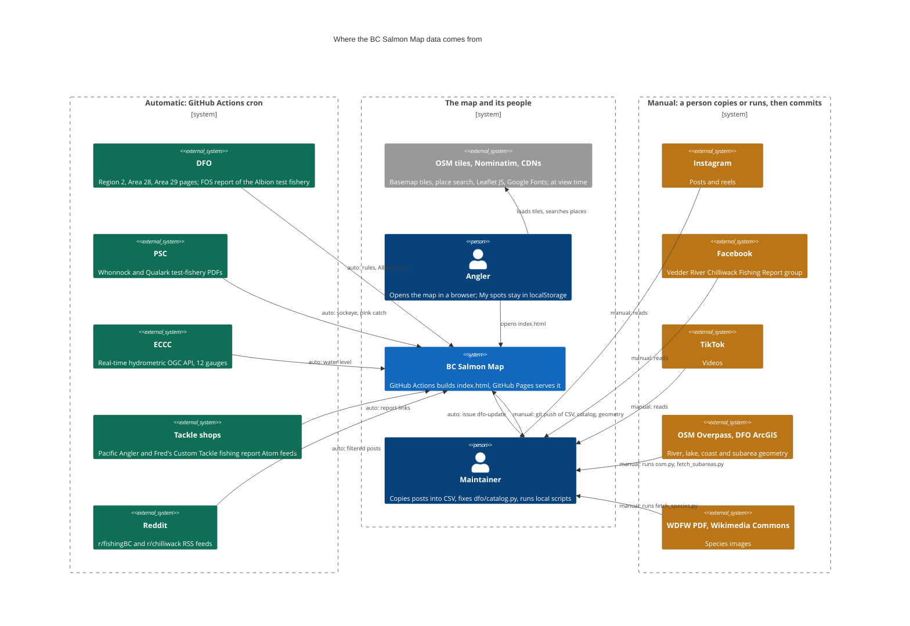
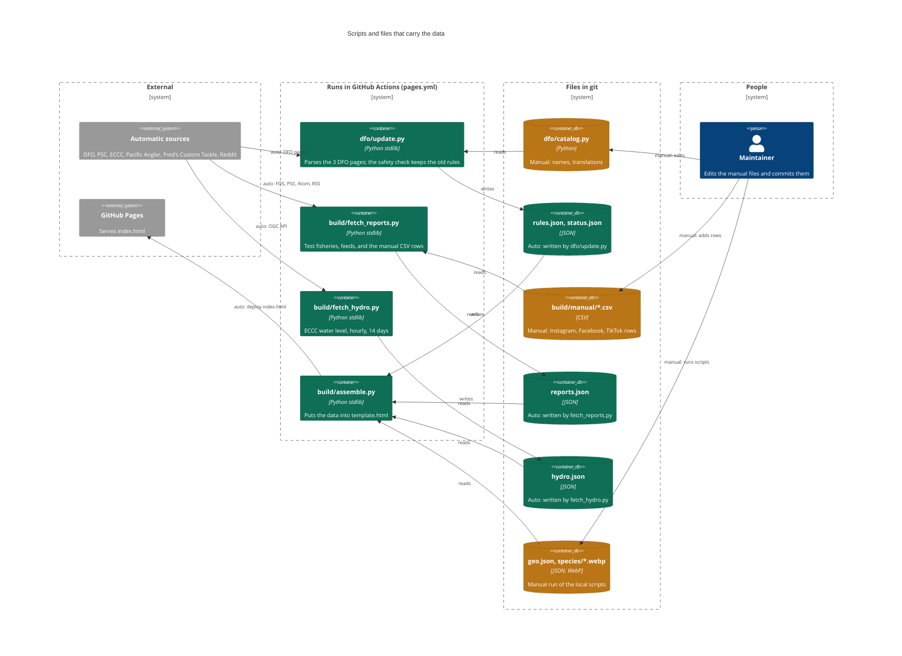

# Data sources and data flow (C4)

This page shows where the map gets its data, and which data come in automatically or by hand.
The diagrams use the [Mermaid C4 syntax](https://mermaid.js.org/syntax/c4.html). GitHub renders them in this file.

- **Automatic:** the GitHub Actions workflow `.github/workflows/pages.yml` gets the data. It runs every day at 15:23 and 16:41 UTC and on every push to `main`.
- **Manual:** a person reads a post or runs a script, edits a file in the repository and commits it.

## Level 1: system context

## Level 2: scripts and files

Colours: green is automatic, amber is manual. The boundary names and the labels on the arrows say the same, so the diagrams also read without colour.

## Notes

- **Instagram, Facebook and TikTok** have no public search API for this use. A person adds each post as one row of `build/manual/reports.csv` (see "Add data by hand" in the [README](../README.md#add-data-by-hand)). If nobody adds rows, these reports leave the page after 21 days, and the page gives no warning.
- **Reddit** is automatic, but the filter keeps only posts that name a map water, salmon and a catch word, and are not questions. A person can add a post that the filter skips to `reports.csv`.
- **DFO** is automatic while the parser understands the pages. When the safety check blocks an update, the workflow opens an issue labelled `dfo-update`, and a person fixes `dfo/catalog.py`.
- **`build/manual/testfish.csv`** has only its header now.
- **Geometry and species images** come from scripts that a person runs locally (`python run_all.py`, `python fetch_species.py <pdf>`). The workflow does not run them; it uses the committed `geo.json` and `species/*.webp`.
- **Place search** sends a place name to [Nominatim](https://nominatim.org/) only when the viewer presses Enter. Coordinates, subarea codes and map waters are found in the page, with no network.
- **"My spots"** stay in the `localStorage` of the browser. The site does not receive them.
